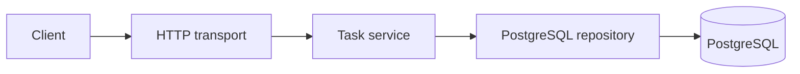

# Checklist Service

[](https://github.com/Forestvov/checklist-service/actions/workflows/ci.yml)

REST API для управления задачами, написанный на Go. Сервис позволяет создавать,
просматривать, завершать и удалять задачи. Данные хранятся в PostgreSQL, схема БД
управляется миграциями, а описание API доступно через Swagger UI.

## Возможности

- создание задачи с валидацией заголовка и описания;
- получение задачи по идентификатору;
- получение списка задач с пагинацией;
- завершение задачи;
- удаление задачи;
- Swagger/OpenAPI-документация;
- health checks для приложения и PostgreSQL;
- structured logging, request ID и обработка panic;
- graceful shutdown;
- unit-тесты transport, service и domain слоёв.

## Стек

- Go 1.26;
- PostgreSQL 18;
- `net/http`;
- pgx;
- Docker и Docker Compose;
- golang-migrate;
- Swagger (`swaggo/swag`);
- zap logger.

## Архитектура



Основной код разделён на слои:

```text
cmd/app                              точка входа, Dockerfile и сборка зависимостей
internal/core                        общая инфраструктура и доменные типы
internal/features/tasks/transport    HTTP handlers и DTO
internal/features/tasks/service      бизнес-логика
internal/features/tasks/repository   работа с PostgreSQL
migrations                           SQL-миграции
docs                                 сгенерированная OpenAPI-документация
```

Transport зависит от интерфейса service, а service — от интерфейса repository.
Конкретные реализации связываются в `cmd/app/main.go`.

## Быстрый запуск через Docker

Понадобятся Docker и Docker Compose.

1. Создайте файл окружения:

   ```bash
   cp .env.example .env
   ```

2. Запустите PostgreSQL, миграции и приложение:

   ```bash
   docker compose up --build
   ```

После запуска доступны:

- API: <http://localhost:5050/api/v1/tasks>;
- Swagger UI: <http://localhost:5050/swagger/index.html>;
- liveness probe: <http://localhost:5050/health/live>;
- readiness probe: <http://localhost:5050/health/ready>.

Остановить контейнеры:

```bash
docker compose down
```

Данные PostgreSQL сохраняются в `out/pgdata`. Для их удаления используйте
`make db-cleanup` и подтвердите операцию.

## Примеры запросов

Создать задачу:

```bash
curl -i -X POST http://localhost:5050/api/v1/tasks \
  -H 'Content-Type: application/json' \
  -d '{"title":"Buy groceries","description":"Milk, bread and vegetables"}'
```

Получить список задач:

```bash
curl 'http://localhost:5050/api/v1/tasks?page=1&per_page=20'
```

Получить одну задачу:

```bash
curl http://localhost:5050/api/v1/tasks/1
```

Завершить задачу:

```bash
curl -i -X PATCH http://localhost:5050/api/v1/tasks/1
```

Удалить задачу:

```bash
curl -i -X DELETE http://localhost:5050/api/v1/tasks/1
```

## API

| Метод | Маршрут | Назначение |
|---|---|---|
| `POST` | `/api/v1/tasks` | Создать задачу |
| `GET` | `/api/v1/tasks` | Получить список с пагинацией |
| `GET` | `/api/v1/tasks/{id}` | Получить задачу |
| `PATCH` | `/api/v1/tasks/{id}` | Отметить задачу выполненной |
| `DELETE` | `/api/v1/tasks/{id}` | Удалить задачу |

Параметры пагинации:

- `page` — номер страницы, по умолчанию `1`;
- `per_page` — размер страницы, по умолчанию `20`, максимум `100`.

## Локальная разработка

Для локального запуска приложения PostgreSQL можно поднять отдельно:

```bash
make migrate-up
make port-up
make app-run
```

Команды разработки:

```bash
make test          # unit-тесты
make test-race     # тесты с race detector
make test-cover    # отчёт о покрытии
make vet           # статические проверки Go
make format        # форматирование
make format-check  # проверка форматирования без изменения файлов
make ci            # все локальные CI-проверки
make build         # бинарный файл в out/bin
make swagger-gen   # обновление Swagger-документации
```

## Конфигурация

Все параметры задаются переменными окружения. Полный пример находится в
`.env.example`.

| Переменная | Назначение | Пример |
|---|---|---|
| `HTTP_ADDR` | Адрес HTTP-сервера | `:5050` |
| `HTTP_ALLOWED_ORIGINS` | Разрешённые CORS origins | `http://localhost:3000` |
| `POSTGRES_HOST` | Хост PostgreSQL | `localhost` |
| `POSTGRES_PORT` | Порт PostgreSQL | `5432` |
| `POSTGRES_USER` | Пользователь PostgreSQL | `checklist` |
| `POSTGRES_PASSWORD` | Пароль PostgreSQL | `checklist` |
| `POSTGRES_DB` | Имя базы данных | `checklist` |
| `POSTGRES_TIMEOUT` | Таймаут операций с БД | `5s` |
| `LOGGER_LEVEL` | Уровень логирования | `DEBUG` |
| `LOGGER_FOLDER` | Каталог файловых логов | `./out/logs` |
| `TIME_ZONE` | Часовой пояс приложения | `UTC` |

При запуске в Docker значения адреса приложения, хоста PostgreSQL и каталога
логов автоматически заменяются на контейнерные.

## Тестирование

```bash
go test ./...
go test -race ./...
go vet ./...
```

Unit-тестами покрыты domain, service и HTTP transport. Следующий запланированный
этап — интеграционные тесты PostgreSQL repository с запуском временной базы.

## Планы развития

- полноценное редактирование и повторное открытие задач;
- фильтрация, сортировка, дедлайны и приоритеты;
- интеграционные тесты repository;
- авторизация и принадлежность задач пользователям;
- публикация Docker-образа;
- метрики и distributed tracing.
